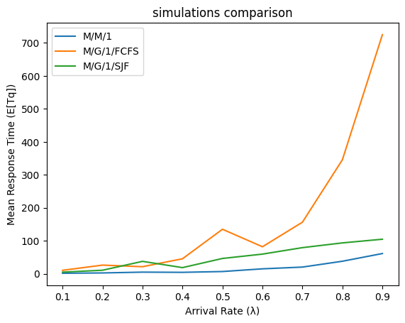

# Large and Social Networks: Queue Simulations

## Overview

This project involves simulating standard queueing systems in Python and comparing their performance against theoretical values and each other. The report is divided into three main parts, each focusing on a different type of queueing system: M/M/1, M/G/1 FCFS, and M/G/1 SJF.

## Team Members
- Χρήστος Ιωαννίδης (2018030006)
- Ηλέκτρα-Δέσποινα Παπαματθαιάκη (2018030106)

## Project Parts

### Part 1: M/M/1 Queue Simulation
Simulates the M/M/1 queue system, generating arrival times using Poisson distribution and comparing results with theoretical values.

### Part 2: M/G/1 FCFS Queue Simulation
Simulates the M/G/1 First Come First Serve (FCFS) queue, using different arrival simulation methods and comparing with theoretical results.

### Part 3: M/G/1 SJF Queue Simulation
Simulates the M/G/1 Shortest Job First (SJF) queue, focusing on different arrival methods and comparing with theoretical values.

## Results

